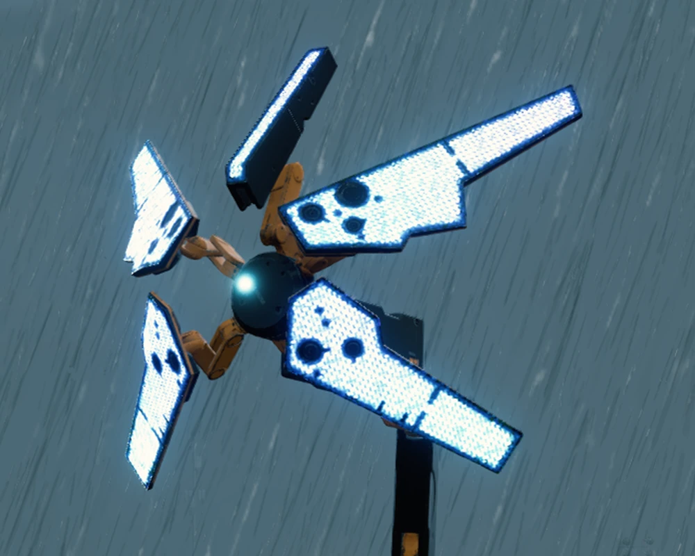
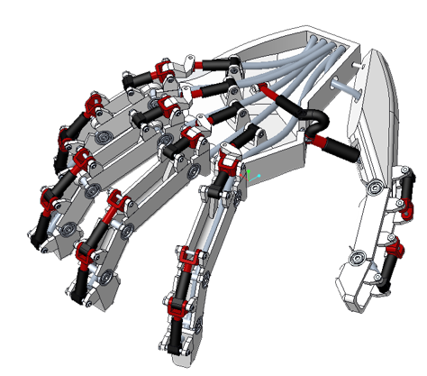

# CAD-Gallery
You can also find my tutorials on [Bilibili](https://www.bilibili.com/video/BV17E421N7AU/?spm_id_from=333.1387.collection.video_card.click&vd_source=4c878cdda4a827e2590557bcbb57b3e5)  
Currently only Chinese tutorials available, may have English version in the future :)  

## Odradek (2020)
From Game: Death Stranding  

  

  

    
    
Odradek Detector In Game

  

## Hand (2021)
ME170: Course Project  

## Hydro-Foil (2021)
Hydrofoil boat in water  

## Hydro-Foil (2023)
Hydrofoil boat in water  

## Gearbox (2023)
ME371: Course Project  
  
**Course Description:**   
Students need to build a cart powered by drill. Cart and drill are provided. Everything else need to be designed by student themselves. The cart need to achieve fast forward, slow forward and reverse motion these three gear shift.  

**Process:**   

First, it is necessary to determine the gear reduction ratio. Check the drill’s maximum torque, power, and RPM, and list the design conditions as follows:

- Target first-gear speed is 3 m/s
- Using coaxial sun gear design
- For simple manufacturing, all planetary gear sets are identical, i.e., they use the same sun, ring, and planetary gears (as shown in the section view below, all gear sets have the same size)

Under this design, the final first-gear reduction ratio is 5.4:1, while another stage has a reduction ratio of 1.5:1. I use https://www.thecatalystis.com/gears/ for visualization

CAD design took around 2 week. Then I started to print the planntery gear using my Voron 0.1 printer. 

**Result:**   
My design win the 1st. place in the final speed competition.  

  

    
    
Section view of gear box

  

  

    
    
I'm "driving" the cart

  

## Balance-Bot (2024)
Project for graduate design  
I made it open source and you can find detailed info at this [repo](https://github.com/MATH-286-Pro/ZJUI-Balance-Infantry-Ver-1.0)

## Gimbal (2024)

